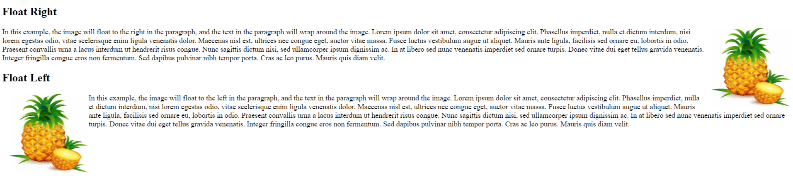
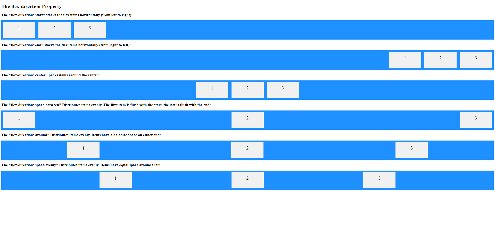

# FlexBox
The “Flexible Box” or “Flexbox” layout mode offers an alternative to Floats for defining the overall appearance of a web page. Whereas floats only let us horizontally position our boxes, flexbox gives us complete control over the alignment, direction, order, and size of our boxes.

The float property can have one of the following values:

* left - The element floats to the left of its container
* right - The element floats to the right of its container
* none - The element does not float (will be displayed just where it occurs in the text). This is default
* inherit - The element inherits the float value of its parent


The following two images demonstrate the additional control that flexbox provides you as compared to float.



# FlexBox Example
## Objective
Our objective is to design this layout


## SetUp
For starters, we need an empty HTML document that contains nothing but a menu bar. Make a new  project called flexbox and create a file named 'flexbox.html' and add the following markup:
```HTML
<!DOCTYPE html>
<html lang='en'>
  <head>
    <meta charset='UTF-8'/>
    <title>Some Web Page</title>
    <link rel='stylesheet' href='styles.css'/>
  </head>
  <body>
    <div class='menu-container'>
      <div class='menu'>
        <div class='date'>Aug 14, 2016</div>
        <div class='signup'>Sign Up</div>
        <div class='login'>Login</div>
      </div>
    </div>
  </body>
</html>
```
Create a stylesheet named styles.css and save it in the same folder
```CSS
* {
  margin: 0;
  padding: 0;
  box-sizing: border-box;
}

.menu-container {
  color: #fff;
  background-color: #5995DA;  /* Blue */
  padding: 20px 0;
}

.menu {
  border: 1px solid #fff;  /* For debugging */
  width: 900px;
}
```
The output for your html file should look like this:


Create an images folder and download the images from here: [images](https://www.internetingishard.com/html-and-css/flexbox/flexbox-images-449705.zip)

Flexbox uses two types of boxes that we’ve never seen before:
* Flex Containers 
* Flex Items : Direct children of a flex container.These items can be flex containers themselves.

The job of a flex container is to group a bunch of flex items together and define how they’re positioned.

# Flex Containers
The first step in using flexbox is to turn one of our HTML elements into a flex container.

To do this we add a 'display' property to the 'menu-container' and assign it a value of 'flex' to turn it into a 'Flex Container'
```CSS
.menu-container {
  /* ... */
  display: flex;
}
```
So now,we have a flex container with one flex item in it. However, our page will look exactly like it did before because we haven’t told the container how to display its item.

The output for your html file still looks like this:


# Aligning a Flex Item

'justify-content' property is used to horizontally align the items inside a flex-container.

Add the following line of code to 'centre' the menu
```CSS
.menu-container {
  /* ... */
  display: flex;
  justify-content: center;    /* Add this */
}
```
Notice that we are  adding a property to the parent element (the flex container) instead of directly to the element we wanted to center (the flex item).
This is a diversion from 'float' where we used to manipulate the item and not the container.

The output for your html file now looks like this:


Other possible values for justify-content are shown below:
* center
* flex-start
* flex-end
* space-around
* space-between

Try experimenting with each of the values and observe how the output changes.

Now we add a 'display' property to the 'menu' and assign it a value of 'flex' to turn it into a 'Flex Container'.
We add a 'justify-content' property to the 'menu' and assign it a value of 'space-between'.
```CSS
.menu {
  /* ... */
  display: flex;
  justify-content: space-between;    /* Add this */
}
```
The output for your html file now looks like this:


# Grouping Flex Items

Flex containers only know how to position elements that are one level deep (i.e., their child elements). They don’t care one bit about what’s inside their flex items.

We want the 'SignUp' and 'Login' on the right side of the page so lets group them in one 'div' and name it 'links'

```HTML
<div class='menu'>
  <div class='date'>Aug 14, 2016</div>
  <div class='links'>
    <div class='signup'>Sign Up</div>      <!-- This is nested now -->
    <div class='login'>Login</div>         <!-- This one too! -->
  </div>
</div>
```

The output for your html file now looks like this:


Instead of having three items, our .menu flex container now has only two (.date and .links). Under the existing space-between behavior, they’ll snap to the left and right side of the page.

Now we need to lay out the .links element because it’s using the default block layout mode.
 * make the .links element a flex container by adding 'display: flex'.
 * add the justify-content property to the .links container and give it a value of 'flex-end'
 
```CSS
.links {
  border: 1px solid #fff;  /* For debugging */
  display: flex;
  justify-content: flex-end;
}
```

The output for your html file now looks like this:


Lets give the .Login element a left-margin so that there is some space between the SignUp and Login texts.

```CSS
.login {
  margin-left: 20px;
}
```
The output for your html file now looks like this:


We won’t need those white borders anymore, so we comment/delete them .

The styles.css now looks like this.

```CSS
* {
    margin: 0;
    padding: 0;
    box-sizing: border-box;
}

.menu-container {
    color: #fff;
    background-color: #5995DA;  /* Blue */
    padding: 20px 0;
}

.menu {
    /*border: 1px solid #fff;  !* For debugging *!*/
    width: 900px;
    display: flex;
    justify-content: space-between;
}
.links {
    /*border: 1px solid #fff;  !* For debugging *!*/
    display: flex;
    justify-content: flex-end;
}

.login {
    margin-left: 20px;
}
```

The output for your html file now looks like this:


So far, we’ve been manipulating horizontal alignment, but flex containers can also define the vertical alignment of their items. This is something that’s simply not possible with floats.

To explore this, we need to add a header underneath our menu. Add the following markup to flexbox.html after the .menu-container element:
```HTML
<div class='header-container'>
  <div class='header'>
    <div class='subscribe'>Subscribe &#9662;</div>
    <div class='logo'></div>
    <div class='social'></div>
  </div>
</div>
```
Add the following lines to styles.css
```CSS
.header-container {
  color: #5995DA;
  background-color: #D6E9FE;
  display: flex;
  justify-content: center;
}

.header {
  width: 900px;
  height: 300px;
  display: flex;
  justify-content: space-between;
}
```

The output for your html file now looks like this:


The 'align-items' property defines the default behavior for how items are laid out along the cross axis (perpendicular to the main axis).
We have a horizontal flexbox layout. That horizontal flow is the main axis, so align-items is the alignment opposite that, on the vertical axis.
You can think of align-items as the justify-content version for the cross-axis (perpendicular to the main-axis).
The possible values of 'align-items' are:
* flex-start
* flex-end
* center
* baseline
* stretch

As we can see presently the flex-items inside the header are aligned to the topside of the header, lets add the following code to align the items to the center.
```CSS
.header {
    width: 900px;
    height: 300px;
    display: flex;
    justify-content: space-between;
    align-items: center;// add this line
}
```

The output for your html file now looks like this:


We see that the 'subscribe' text and the 'social' icons are aligned at the center, but we want them at the bottom edge of the header
To do this we add the following code to the CSS file.
```CSS
.social,
.subscribe {
   align-self: flex-end;
    margin-bottom: 20px;
}
```
The align-self property specifies the alignment for the selected item inside the flexible container.

The align-self property overrides the flexible container's align-items property.So the previously written 
'align-items:centre' does not apply .

The output for your html file now looks like this:


Lets now create the photo-grid-container
Add the following lines of code to flexbox.html
```HTML
<div class='photo-grid-container'>
</div>
```
Lets make it a flex-container and align the flex-items inside it to center
```CSS
.photo-grid-container {
    display: flex;
    justify-content: center;
}
```
Lets create a new div named photo-grid inside the photo-grid-container where we will be placing the photos.

```HTML
<div class='photo-grid-container'>
    <div class='photo-grid'>

    </div>
</div>
```
Add the following properties to the CSS file
```CSS
.photo-grid {
    justify-content: center;
}
```

* Make it a flex-container
* Justify the content to the center
* The flex-wrap property specifies whether the flexible items should wrap or not
* The flex-direction property specifies the direction of the flexible items.
* Vertically align the items to the center

Lets place the photos now inside the photo-grid div.
```HTML
<div class='photo-grid-container'>
    <div class='photo-grid'>
        <div class='photo-grid-item '>-->
            
        </div>
        <div class='photo-grid-item'>
            
        </div>
        <div class='photo-grid-item'>
            
        </div>
        <div class='photo-grid-item'>
            
        </div>
        <div class='photo-grid-item '>
            
        </div>
    </div>
</div>
```
Add the following lines to the CSS file to give the items and width and height.
```CSS
.photo-grid-item {
    border: 1px solid #fff;
    width: 300px;
    height: 300px;
}
```
The output for your html file now looks like this:


Lets make the photo-grid a flex-container 
```CSS
.photo-grid {
    justify-content: center;
    display:flex;
}
```
The output for your html file now looks like this:


We see that the photos get aligned in a row even if we havent mentioned the flex-direction.This is because
the flex-direction in a flexbox is a row by default.

Lets add the following lines to the CSS file
```CSS
.photo-grid {
    display: flex;
    justify-content: center;
    width: 900px;
    flex-wrap: wrap;
    flex-direction: row;
    
}
```
We give the phot-grid a width of 900px and add the flex-wrap property to wrap the photos if they
exceed the width.
We also assign the flex-direction as row although its not necessary as the flex-direction is row by default.

The output for your html file now looks like this:


We notice that we need to rearrage the photos as in the desired output 5 comes first and 1 is the last item.
To do this we assign a flex items an order.
* The items have a default order of 0.
* They are arranged in an ascending order as per the order value.
* So to put the FIVE  to the beginning we assign it an order of -1.
* To put the ONE  to the end we assign it an order of 1.
* The other items will have an order of 0 by default and will be arranged as per their position in the div.


```HTML
<div class='photo-grid-container'>
    <div class='photo-grid'>
        <div class='photo-grid-item first-item'>
            
        </div>
        <div class='photo-grid-item'>
            
        </div>
        <div class='photo-grid-item'>
            
        </div>
        <div class='photo-grid-item'>
            
        </div>
        <div class='photo-grid-item last-item'>
            
        </div>
    </div>
</div>
```
We assign a class-name first item to image ONE, and a class-name last-item to image FIVE.
Lets now add the following CSS properties.

```CSS
.first-item {
    order: 1;
}

.last-item {
    order: -1;
}
```
The first-item (image ONE) is assigned an order of 1 so it appears at the last.
The last-item (image FIVE) is assigned an order of -2 so it appears at the beginning.

The output for your html file now looks like this:


Lets now add the footer items
```HTML
<div class='footer'>
    <div class='footer-item '></div>
    <div class='footer-item '></div>
    <div class='footer-item '></div>
</div>
```
And the CSS
```CSS
.footer {
    display: flex;
    justify-content: space-between;
}
.footer-item {
    border: 1px solid #fff;
    background-color: #D6E9FE;
    height: 200px;
    flex:1;
}
```
We create a flex-container and put the three footer-items inside it.Every footer-item has a flex of 1.
The flex property sets the flexible length on flexible items.Here each flex-item has a flex of 1 so they share the available width in the same ratio.

The output for your html file now looks like this:


We can see that the three flex-items are sharing the available width in the same ratio.
The first and the third flex-item have a different color. So lets assign them a different color.

Assign them three class names footer-one, footer-two and footer-three
```HTML
<div class='footer'>
    <div class='footer-item footer-one'></div>
    <div class='footer-item footer-two'></div>
    <div class='footer-item footer-three'></div>
</div>

```
And the CSS
```CSS
.footer-one,
.footer-three {
    background-color: #5995DA;
}
```
The output for your html file now looks like this:


We want the first and third footer to be smaller in size so lets give them a fixed width.
```CSS
.footer-one,
.footer-three {
    background-color: #5995DA;
    width: 300px;
}
```
We see that the output doesnt change and still looks like this.


This is because the flex overrides the width.So the flex-items still have a flex of 1.
To override the flex lets change the code a bit.

```CSS
.footer-one,
.footer-three {
    background-color: #5995DA;
    width: 300px;
    flex: initial;
}
```
flex:initial  sizes the item based on its width/height properties.

The output for your html file now looks like this:

